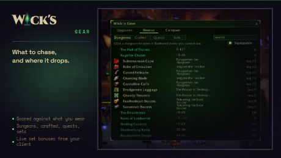

# Wick's Gear

What to chase while levelling, and a quick way to look up what drops where.

**Upgrades** scores every levelling drop against what you are wearing and
names the best piece per slot, in points of your class's main stat.

**Browse** is a dungeon-by-dungeon list. Not a replacement for a full loot
browser, just enough to answer "what's in here" without installing one.

    /wgear            upgrades
    /wgear browse     what drops where
    /wgear options    weights, and which way you play

The addon ships item ids and where they come from, and nothing else. Every
name, icon, stat and tooltip is asked of the client as you open the window,
so the numbers are the ones this server is using and nothing goes stale
against a patch.

Weights are tuned for levelling rather than raiding. At 60 you maximise
damage over a fight you repeat; levelling you minimise time to the next
level, and the drain on that is downtime. Stamina and Spirit are worth more
here than any endgame list would allow, on purpose.

Requires WickCore.

MIT licensed code. The Wick name and mark are not covered by that licence;
see LICENSE.
